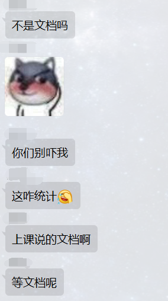
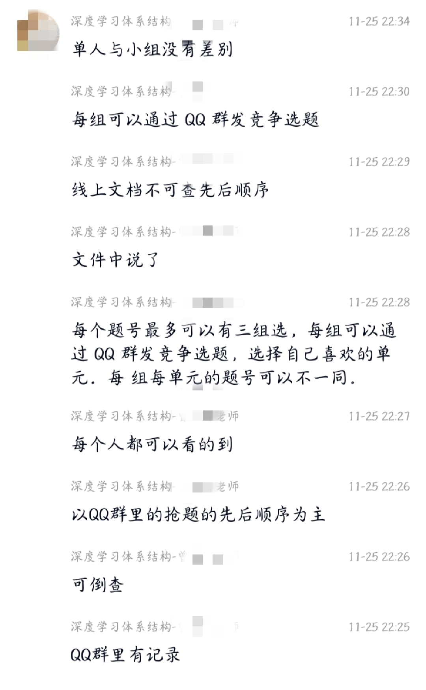
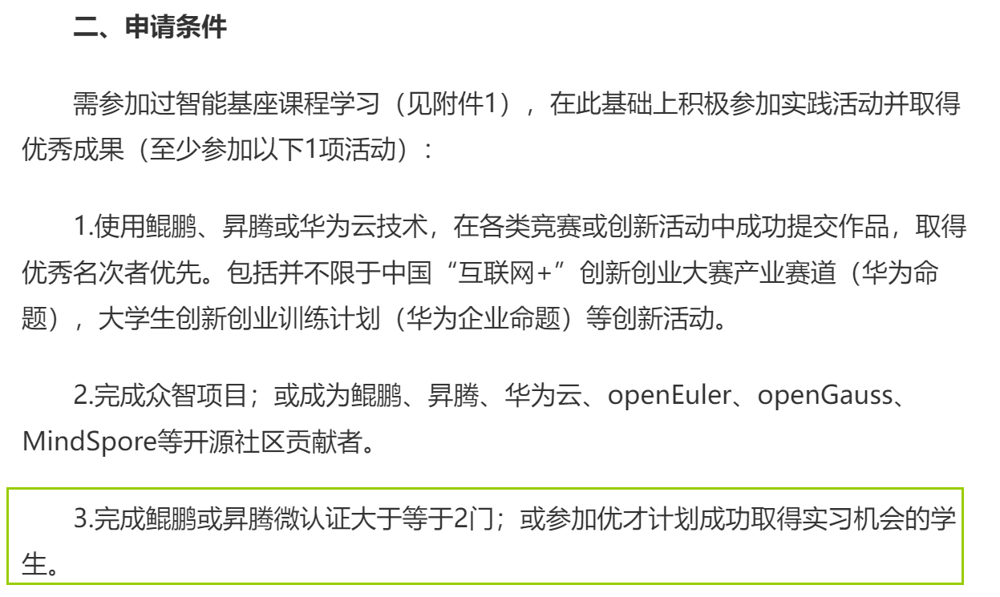
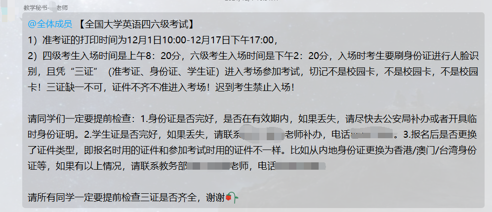
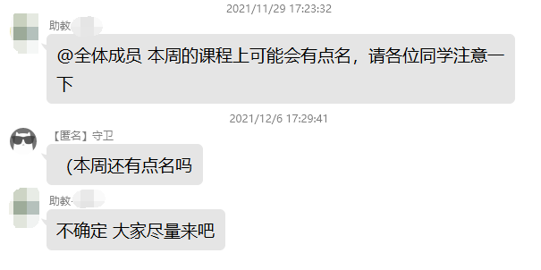
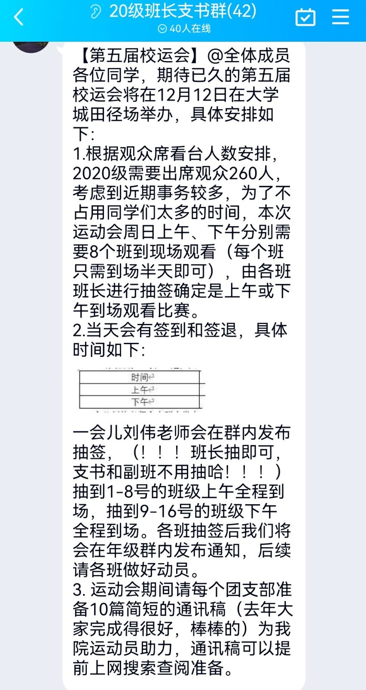

# 大学蚌埠事件

> 记录一些 $\large\scr A\cal{ilan} \scr X \cal{ier}$ 在哈尔滨工业大学（深圳）遇到的一些难绷（迷惑）的事件。
>
> + 大蚌埠：😅
> + 中蚌埠：😰
> + 小蚌埠：😢

+ 深度学习体系结构选课事件😅：

  + 起因：

    ​	分组调研选题，每个题目最多由三组（一组 3 人）选择，老师课上说会在 9 点半（原定 9 点，但是因为有同学没有空就推迟了）在群里发选题的腾讯文档。但是腾讯文档的先后顺序不可查，本身也容易产生冲突，所以很多同学有疑虑，但是也都默认按规则来了。

  + 冲突：

    ​	9 点钟有人没看推迟通知，直接就在 QQ 群发选题了，然后引起小波从众行为，直到有人说「不是说 9 点半开始吗」、「不是填腾讯文档吗」等疑惑，才收敛刷屏。于是大家开始等待 9 点半的抢题。9 点半一到，瞬间 10 几条抢课消息直接发在了 QQ 群，而老师却不见了。因为害怕突然改变抢课规则，大家也都陆陆续续在 QQ 群上刷屏抢题的题号，场面非常混乱。然后很多同学质疑，「不是用腾讯文档吗，发在群里这么乱」，如图：

    

    ​	很多同学因为觉得这样破坏了规则，就没有跟着刷屏，而是耐心等待老师发真正的选题腾讯文档，大家也就这样守着屏幕，结果一直到 10 点了，老师仍没有发腾讯文档。

    > 这一天是非常忙的，忙的程度就是这件事发生一个月后才有时间记录下来

  + 高潮：

    ​	晚上 10 点 23 分 25 秒，老师突然上线发了腾讯文档，然后就开始疯抢，出现自己填的单元格被别人持续覆盖等混乱情况，然后老师开始发表迷惑发言：

    

    ​	遵守规则的反而被老师说成是不懂规则的，吃了亏，腾讯文档的顺序没有一点用，反而是直接在 QQ 群发抢课的赚了。后续老师在课上也和同学争辩，但是也没有怎么管了，毕竟比较佛，于是选课冲突就不了了之了，实在太难排序出谁是哪一组，又选了什么课。事实上每个课题差距不大，笔者并未参与争论，也是从众的一员，但发的比较晚。

  + 迷惑之处：

    + 为什么朝令夕改
    + 为什么直到约定时间的将近一个小时后才发选课文档

+ 机器学习签到事件😅：

  + 课上签到规则：

    + 迟到门口罚站 5 分钟

    + 一节课若干次签到，缺一次算旷课

    + 采用雨课堂选择题签到方式，为了防止发答案给其他同学，题目的答案最后 10 秒才会公布，答错或者没答算旷课

      > 后面有各种花式签到法，比如先发一道题，故意一直不公布答案，然后对做了这题的同学算旷课，虚晃一枪。

    + 旷课一次扣 5 分，旷课次数超过阈值不能参加考试，直接挂科

  + 出现情况：

    + 同学手速慢没签上
    + 不小心选错或是选了多个选项
    + 网络超时没选上

  + 可以马上联系助教补签，证明自己在场

    > 为什么同学会不来上课呢？
    >
    > ​	这段时间是进入大学以来最忙的时候，用操作系统的话来说，就是每科老师像一个用户，都给一个叫学生的计算机发指令，指令包括作业，实验和考试，学生必须分时调度处理这些任务，这让老师感觉自己好像独占一个学生的一个指令周期（DDL）。学生忙于调度，只能牺牲当前最不需要付出代价的上课时间，待以后有时间再复习补回。这效率是非常低的，而且容易因为频繁切换任务而引起颠簸，导致性能极具下降。所以减负，不应该仅仅是延期任务，延期可能导致和后面接踵而至的其他 DDL 继续冲突，该按时完成的还是得按时完成。笔者认为这需要多方面合作，课程之间相互沟通，不要在考试周布置太多作业，尽量减少作业的占用时间，提高任务的质量而不是数量。

+ 华为「智能基座」奖学金捡漏事件😰：

  + 奖金 5000（税后可能低一点）

  + 名额 30 个

  + 最后公布的名单只有 29 个，估计申请的人没满

  + 名单中有学分绩倒数的（学分绩估分在 30 左右），确实也满足要求，因为要求是看完网课就有认证：

    

  + 因为一开始以为要参加过华为的活动才有资格参评，所以很多同学没报，导致甚至没报满名额，算是一种捡漏了。

+ 教学秘书表情「🌹」打成「🥀」事件😢：

  

  ​	教秘还是很好的，开心一下，小蚌。

+ 信息安全概论群点名事件😢：

  

  ​	助教提醒签到非常人性化了，和机器学习课程比较就知道了，结果匿名直接问（意思就是不点名就不来了），这不是逼助教点名吗😂

+ 第五届校运会全体 19 级强制参加事件😰：

  > 事件前提：校运会后的第三天考操作系统，时间非常紧张

  + 本来是 19 级全体强制参加，20 级部分参加，这里只放 20 级的一个通知图：

    

    > 笑话：
    >
    > 「为什么今年大三强制参加？」
    >
    > 「因为去年是大二强制参加，所以今年轮到大三」
    >
    > 只是开开玩笑，去年好像并未强制。

  + 上午签到辅导员看着，不能帮签。最后很多同学就是签完到就走，然后再回来签退

  + 下午因为辅导员比赛，让班长管理签到表，导致很多同学直接不来了，对比上午同学多少有点吃亏了（指真的不太喜欢看校运会的同学）

  + 其实只看半天也没有很大问题，算是比较人性化了，但是就是推迟一周比较好吧，考试周这样强制难免有点勉强了。
